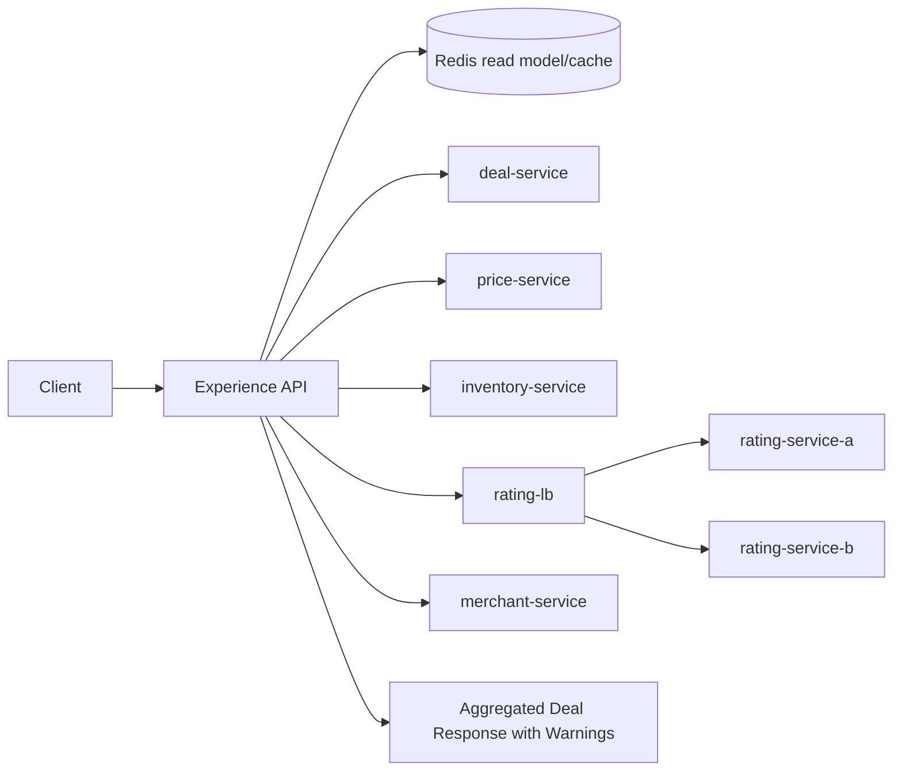
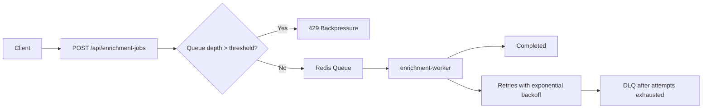
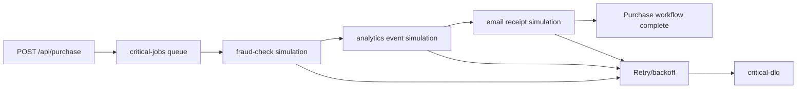
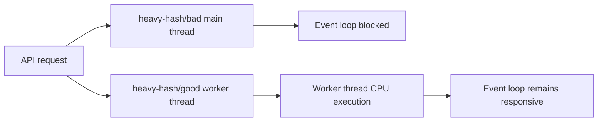

# Node.js Services Under Load Study Lab

A complete local microservices learning platform that simulates a Groupon-like "Deal Experience Platform" and focuses on production Node.js concerns:

- Concurrency control
- Backpressure
- Observability (logs, metrics, tracing)
- SLO/SLI/SLA
- Event loop blocking vs worker threads
- Resilience patterns (timeouts, retries, degradation)
- Graceful shutdown
- Queue processing at scale

All application code is JavaScript for Node 20+.

## Architecture

### Services

- `experience-api` (`localhost:3000`): aggregator and orchestration layer
- `deal-service` (`localhost:3001`): base catalog data
- `price-service` (`localhost:3002`): pricing and discounting
- `inventory-service` (`localhost:3003`): availability
- `rating-lb` (`localhost:3014`): load balancer for rating replicas
- `rating-service-a` (`localhost:3004`): rating replica A
- `rating-service-b` (`localhost:3006`): rating replica B
- `merchant-service` (`localhost:3005`): merchant metadata
- `slo-dashboard` (`localhost:3100`): parses Prometheus text metrics and evaluates SLOs

### Workers

- `enrichment-worker`: high-volume enrichment jobs with retries and DLQ
- `critical-worker`: purchase workflow jobs (fraud check, analytics, email) with retries and DLQ

### Infrastructure

- `redis` (`localhost:6379`): BullMQ backend + read-model/cache store for hybrid list reads
- `redis-commander` (`localhost:8081`): Redis queue inspection UI

## API Endpoints (`experience-api`)

- `GET /api/deals?city=valencia&limit=20`
- `GET /api/deals/:id`
- `POST /api/purchase`
- `POST /api/enrichment-jobs`
- `POST /api/heavy-hash/bad`
- `POST /api/heavy-hash/good`
- `GET /healthz`
- `GET /readyz`
- `GET /metrics`

## Setup

### Prerequisites

- Node.js 20+
- Docker + Docker Compose

### Install dependencies

```bash
npm install
```

### Run locally (Node processes)

```bash
npm run dev
```

This launches all services, workers, and dashboard together.

### Run with Docker Compose

```bash
docker compose up --build
```

## Load Tests

### Deals read traffic

```bash
npm run load:deals
```

### Queue-heavy mode

```bash
npm run load:enqueue
```

### Mixed stress mode

```bash
npm run load:mixed
```

### Generic CLI

```bash
node tools/load.js --target=http://localhost:3000 --duration=30 --concurrency=50 --mode=mixed
```

Modes:

- `deals`
- `enqueue`
- `hash-bad`
- `hash-good`
- `mixed`

CLI output includes:

- Requests sent
- Success/failures
- RPS
- Avg latency
- p95 latency estimate

## Dashboard (`http://localhost:3100`)

The dashboard polls every 2 seconds and drives four live views:

- `/api/sli`: SLI/SLO cards and trend charts
- `/api/topology`: service graph, edge stats, ingress rates
- `/api/scenarios`: scenario activation state + explanations
- `/api/hybrid`: hybrid read-model effectiveness and fan-out reduction

It shows:

- p95 latency
- error rate
- queue depth
- queue lag estimate
- upstream failure rate
- request rate

It also evaluates SLOs:

- p95 latency `< 300ms`
- error rate `< 1%`
- queue depth `< 1000`

Scenario buttons trigger live experiments:

- Normal traffic (default)
- Spike traffic
- Chaotic scenario
- High throughput (max load)
- Enqueue 10k jobs
- Trigger blocking hash
- Trigger worker-thread hash

### Dashboard Deep Dive

#### 1) SLI cards and formulas

- `requestRateRps = Δ(experience_http_request_duration_seconds_count) / Δt`
- `errorRatePct = (Δ(experience_http_request_errors_total) / Δ(request_count)) * 100`
- `p95LatencyMs = histogramQuantile(0.95, experience_http_request_duration_seconds_bucket) * 1000`
- `upstreamFailureRatePct = (Δ(experience_upstream_failures_total) / Δ(experience_upstream_requests_total)) * 100`
- `queueDepth = enrichment_depth + critical_depth`
- `queueLagEstimateSec = queueDepth / queueCompletionRatePerSecond` (or `Infinity` if depth > 0 and completion rate is 0)

#### 2) Service topology graph

- Left-to-right graph: `clients -> experience-api -> downstream services/queues/workers`
- Edge labels include live RPS, p95, failure rate, queue depth/lag depending on edge type
- Color modes:
  - Auto severity colors
  - Manual palette override with persistence
- You can drag boxes to customize layout; positions persist in browser storage

#### 3) Redis in the graph (why it is connected)

Redis has two roles:

- Queue state backend for BullMQ (`enrichment-jobs`, `critical-jobs`)
- Read-model/cache for hybrid list responses in `experience-api`

Graph details:

- `experience-api -> redis`: cache/read-model usage
- `redis -> enrichment-queue` and `redis -> critical-queue`: queue backend relationship
- Redis node now shows cache metrics:
  - read-model hits/misses and hit %
  - base catalog cache hits/misses and hit %

#### 4) Why high ingress RPS can show low fan-out RPS

When `high-throughput` sends many `GET /api/deals` requests, most are served from Redis read-model/cache. That keeps downstream fan-out traffic low even if ingress RPS is very high.  
To force downstream fan-out, use scenarios that generate more `/api/deals/:id` traffic (detail path) or combined mixed load.

### Scenario Guide (What To Look At)

- `Normal traffic`: steady baseline
  - Look at stable low error rate, moderate p95, small queue depth
- `Spike traffic`: short read bursts
  - Look for p95 jumps, upstream retries/timeouts, temporary degradations
- `Chaotic scenario`: mixed unpredictable pressure
  - Look for simultaneous movement in latency, errors, queue depth, and worker lag
- `High throughput (max load)`: sustained ingress stress
  - Look for high client ingress and where bottlenecks appear
- `Enqueue 10k jobs`: queue pressure test
  - Look for depth growth, lag growth, and eventual 429 admission control
- `Trigger blocking hash`: event-loop blocking
  - Look for API latency spikes and degraded responsiveness
- `Trigger worker-thread hash`: CPU offload control test
  - Compare with blocking hash to see lower event-loop impact

## Service Purpose and What To Observe

| Component | Purpose | What to observe |
|---|---|---|
| `experience-api` | Aggregates data, applies retries/timeouts/degradation, enqueues jobs | Ingress RPS, p95, error rate, warning/degraded responses |
| `deal-service` | Source of base deal catalog | Upstream request rate and latency under list/detail load |
| `price-service` | Computes discounted pricing | Added latency in fan-out and failure contribution to degraded responses |
| `inventory-service` | Availability checks | Behavior during spikes and impact on purchase/detail quality |
| `rating-lb` | Distributes rating traffic between replicas | Per-target distribution and target health/error changes |
| `rating-service-a` / `rating-service-b` | Rating replicas with independent health and errors | Load-balancing spread, per-target failure rate, health flips |
| `merchant-service` | Merchant metadata enrichment | Upstream call rate during detail fan-out |
| `enrichment-worker` | Processes enrichment queue with retries/DLQ semantics | Completion rate, queue lag, failure rate |
| `critical-worker` | Purchase workflow pipeline (fraud/analytics/email) | Critical queue lag, processing stability under load |
| `redis` | Queue backend + read-model/cache store | Queue depth, cache hit rates, readiness |
| `slo-dashboard` | Learning UI for metrics + scenarios + topology | Correlated behavior across latency/errors/queues/fan-out |

## Production Concepts Implemented

### Concurrency control

`experience-api` uses `p-limit` to cap upstream fan-out calls and avoid `Promise.all` explosion.

### Timeouts + retries

All upstream GET requests use `undici` with explicit timeout (`800ms` default) and one retry with jitter.

### Graceful degradation

If non-critical upstreams fail, responses still succeed with warnings:

```json
{
  "deals": [],
  "warnings": ["rating-lb timeout"],
  "meta": { "requestId": "..." }
}
```

### Backpressure

`POST /api/enrichment-jobs` applies admission control. If queue depth crosses threshold, API returns `429`.

### Event loop blocking demo

- `POST /api/heavy-hash/bad` runs CPU work on the main thread
- `POST /api/heavy-hash/good` offloads the same work to `worker_threads`

### Observability

- Structured logs via `pino` + `pino-http`
- Correlation IDs (`x-correlation-id`) across services
- Prometheus metrics via `prom-client`
- OpenTelemetry SDK Node + auto instrumentation

### Operational patterns

- `/healthz` for liveness
- `/readyz` for readiness (`redis` + upstream health checks)
- Graceful shutdown on `SIGINT`/`SIGTERM`

## Lockfiles and Dependency Governance

This project includes `package-lock.json` and uses it to keep installs deterministic over time.

Why lockfiles matter:

- They pin transitive versions for reproducible installs
- They reduce "works on my machine" drift
- They improve incident debugging by preserving dependency history

Recommended install in CI/CD and containers:

```bash
npm ci
```

## Learning Checklist

- [ ] Observe degraded responses when one upstream fails or times out
- [ ] Watch request latency and error counters in `/metrics`
- [ ] Force queue overload and verify `429` admission control
- [ ] Compare `/api/heavy-hash/bad` vs `/api/heavy-hash/good` under load
- [ ] Trigger purchase jobs and inspect retries + DLQ behavior
- [ ] Use Redis Commander to inspect queue depth and stuck jobs
- [ ] Validate `/readyz` behavior when a dependency is down
- [ ] Stop services with `Ctrl+C` and confirm graceful shutdown logs

## Mermaid Diagrams

### Deal Aggregation Flow



### Queue Backpressure



### Purchase Pipeline



### Worker Thread Hashing


